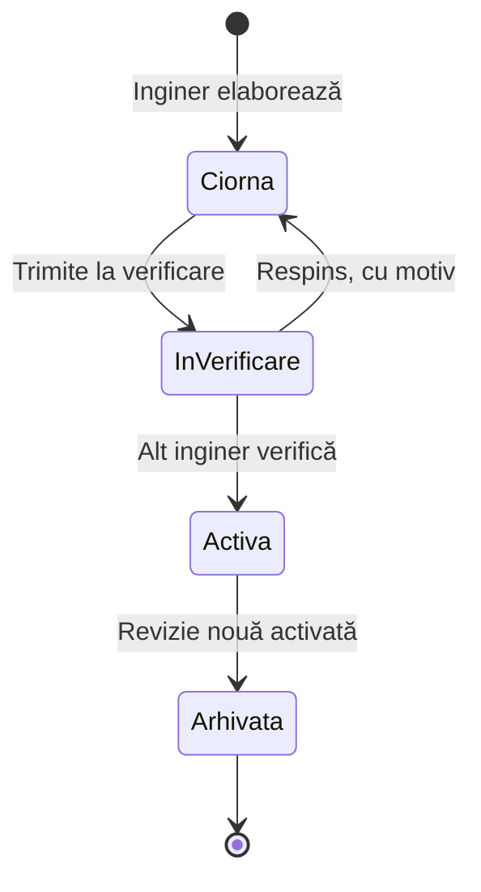
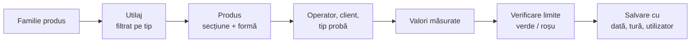

# ROMCAB CTC — Specificație funcțională

Versiune: 25.09.2026 · Autor: Zoltan Biro (ROMCAB S.A.)
Sursa de adevăr: documentul „ROMCAB CTC — Specificație funcțională” (Claude Docs). Acest fișier este exportul lui pentru dezvoltare.

Aplicația înlocuiește fișele Excel ale CTC și anexele tehnologice A6 cu o singură bază de date: inginerii întrețin fișele tehnice, CTC doar selectează produsul și introduce valorile măsurate, iar limitele, verificarea și istoricul sunt automate. Rulează pe un server Windows din fabrică, fără internet și fără programe externe (Node.js portabil + SQLite), accesibilă din browser pe rețeaua internă. Interfața este integral în limba română.

## 1. Roluri și drepturi

Trei roluri, conturi individuale cu parolă; fiecare acțiune se înregistrează cu utilizatorul și ora.

| Acțiune | Administrator | Inginer | Personal (CTC, Manager proces) |
| --- | --- | --- | --- |
| Introducere măsurători | da | da | da (CTC) |
| Vizualizare istoric, grafice, export | da | da | da |
| Corectare înregistrare proprie (cu motiv, versiune nouă) | da | da | da, în aceeași tură |
| Elaborare fișă tehnică / revizie | nu | da | nu |
| Verificare și activare revizie | nu | da (alt inginer decât elaboratorul) | nu |
| Nomenclatoare: utilaje, operatori, clienți, tipuri probă | da | da | nu |
| Utilizatori, backup, setări sistem | da | nu | nu |

Înregistrările nu se șterg și nu se suprascriu: o corectură creează o versiune nouă, iar istoricul arată cine, când și de ce a modificat.

## 2. Structura produselor

Un produs se identifică prin familie + material (Cu / Al) + secțiune + formă + destinație; CTC alege doar din aceste liste, restul datelor vin din fișa tehnică activă.

| Familie | Niveluri măsurate | Date din fișa tehnică | Se măsoară |
| --- | --- | --- | --- |
| Sârmă trefilată (clasa I–II) | sârmă | filieră, Ø nominal, Ø min–max, nr. fire în conductor, masă min–max (kg/km) | Ø (2 citiri), masă; R la RE unifilar Cu |
| Sârmă trefilată multifilar (clasa V) | sârmă | filieră (inclusiv combinații, ex. 5 × 0,310 + 3 × 0,305), Ø sârmă, Ø sârmă în liță | Ø (2 citiri) |
| Conductor extrudat Al (clasa 1) | conductor RE / SE | Ø nominal și Ø min–max (RE), filieră trefilare, masă min–max (g/m); Î × L (SE) când vor fi stabilite | Ø sau Î × L, masă; R teoretică |
| Funie rigidă (clasa 2) | funie | construcție nr. × Ø, Ø funie (rotund sau Î × L), masă min–max (g/m), parametri cablare pe rotor (pas, tensionare), tensionare recepție | Ø (2 citiri) sau Î × L, masă, R măsurată (doar Cu), R teoretică |
| Conductor flexibil (clasa 5) | suvită, toron, liță | nr. fire liță / toroane / fire în toron / fire în suvită, masă min–max suvită și toron, masă aprox. liță | masă pe fiecare nivel, R la liță (sau toron raportat la liță) |

- **Materiale:** Cu (ETP1), Al (H11); opțiune *cositorit* la Cu (schimbă limita de rezistență).
- **Forme:** RE, RM, RMC, SM 72° / 90° / 120°, SM drept, SE; lista se poate extinde.
- **Destinații:** Unifilar, Multifilar, Armate, Purtător, EVN; lista se poate extinde.
- Familiile noi se adaugă ulterior fără modificarea structurii de bază.

**Limite nedeterminate („–” în fișă):** câmpul rămâne gol și apare ca „nedeterminat”. CTC introduce totuși valoarea măsurată, care se salvează fără verdict verde / roșu pentru acel parametru. Din aceste date, aplicația arată inginerului media, minimul, maximul și abaterea standard, ca bază pentru stabilirea limitelor într-o revizie următoare.

**Ce se măsoară se setează pe familie:** fiecare familie are bifate mărimile cerute (Ø, Î × L, masă, rezistență), deci ecranul CTC arată doar câmpurile relevante.

**Rezistența se măsoară deocamdată doar la cupru.** La aluminiu câmpul de rezistență măsurată este dezactivat (se afișează doar R teoretică); se poate activa ulterior pe familie, fără modificări în aplicație.

## 3. Fișe tehnice și revizii

Fiecare fișă tehnică (echivalentul unei anexe A6 sau al unei instrucțiuni de cablare) are Cod, Ediție și Revizie; o singură revizie este activă la un moment dat, iar fiecare măsurătoare păstrează revizia în vigoare.



- **Elaborat / Verificat:** numele și data se completează automat din conturi; elaboratorul nu își poate verifica propria revizie.
- **Revizie nouă:** se pornește din cea activă; inginerul modifică doar valorile necesare.
- **Evidențierea modificărilor:** aplicația compară cu revizia anterioară și marchează cu roșu valorile schimbate, pe ecran și la tipărire (ca în documentele actuale).
- **Istoric:** orice revizie veche rămâne consultabilă și tipăribilă.
- **Validare la verificare:** construcțiile se verifică față de IEC 60228 (număr minim de fire, Ø maxim fir); abaterile blochează activarea, cu excepția celor marcate ca excepție acceptată (secțiunea 6).

## 4. Nomenclatoare

Toate listele sunt editabile de Inginer sau Administrator (adăugare, redenumire, dezactivare); o intrare folosită în măsurători nu se șterge, doar se dezactivează.

| Listă | Conținut | Exemple |
| --- | --- | --- |
| Tipuri de utilaj | procesul și familiile de produs permise | Trefilare, Trefilare multifilară, Cablare rigidă, Sector / extrudare, Cablare flexibil |
| Utilaje | nume, tip, configurație rotoare (la stranderi) | RIGID 1, RIGID 2, KABMAK 1, LITARE 1; strander 1+6+12 / 1+6+12+18 / 1+6+12+18+24 |
| Operatori | nume (nu sunt utilizatori ai aplicației) | nume și prenume, activ / inactiv |
| Clienți | nume scurt, activ / inactiv | SBT, TUB, VOLT, ESI, Iemar |
| Tipuri de probă | listă extensibilă | Probă de pornire, Lungime (numărul se incrementează automat), După reglaj |
| Ture și schimburi | 2 ture de 12 h (06–18 zi, 18–06 noapte), 3 schimburi A / B / C în ciclu de 12 zile: 4 zile, 2 libere, 4 nopți, 2 libere; data de start a ciclului se setează pe schimb | Tura zi / noapte; Schimb A, B, C |

- **Filtrare:** la alegerea familiei de produs apar doar utilajele de tipul potrivit.
- **Capacitate strander:** o construcție apare doar pe stranderele cu suficiente straturi (ex. 37 fire necesită minim 1+6+12+18).
- **Parametri cablare:** pasul și tensionarea pe rotor se rețin pe construcție și tip de strander.
- **Tura și schimbul** se atribuie automat din ora înregistrării; măsurătorile de după miezul nopții aparțin turei de noapte începute în ziua precedentă.

## 5. Înregistrarea măsurătorilor

CTC completează un singur ecran, de pe PC-ul din laborator sau din hală; aplicația afișează limitele imediat și marchează rezultatul verde / roșu înainte de salvare.



| Câmp | Cine completează | Observații |
| --- | --- | --- |
| Dată, oră, tură, schimb, utilizator | automat | tura și schimbul din ciclu |
| Familie, utilaj, produs | CTC, din liste | limitele și revizia activă se încarcă automat |
| Operator, client, tip probă | CTC, din liste | nr. lungimii se propune automat |
| Diametru | CTC | două citiri perpendiculare la sârmă și funie rotundă (media și ovalitatea se calculează, ambele citiri se verifică față de limite); Î × L la sector |
| Masă probă [g] + lungime probă [mm] | CTC | lungimea implicită 1000 mm, modificabilă |
| Rezistență măsurată + temperatură [°C] + lungime probă [m] | CTC, la Cu | implicit 5 m, 2 m la secțiuni mari |
| Lungime produsă [m] | CTC, opțional | pentru consumul suplimentar în kg |
| Observații | CTC, opțional | text liber |

Calcule efectuate de aplicație:

- Masa pe metru: m [g/m] = m_probă [g] / L_probă [mm] × 1000
- Corecția de temperatură (IEC 60228, Anexa B, pe material): R20 = Rt × kt, kt = 1 / (1 + α20 · (t − 20)), α20 Cu = 0,00393, α20 Al = 0,00403. Reproduce exact foaia Excel „Corecție temp.” (ex. Cu la 27 °C: 0,9732; Al la 40 °C: 0,9254). În afara 0–40 °C aplicația avertizează. Coeficienții se pot modifica de Inginer.
- Rezistența raportată pe km: R [Ω/km] = R_măsurată [Ω] / L_probă [m] × 1000 (dacă aparatul nu afișează direct Ω/km).
- Rezistența teoretică din masă (Cu și Al): A [mm²] = m [g/m] / δ [g/cm³]; d_ech = √(4A/π); R20_teor [Ω/km] = 1000 · ρ20 / A. Implicit Cu ETP1: ρ20 = 0,01707 Ω·mm²/m, δ = 8,89 g/cm³; Al H11: ρ20 = 0,0275 Ω·mm²/m, δ = 2,703 g/cm³ (modificabile de Inginer).
- R teoretică primește verdict față de limita IEC: la Al este singura valoare de rezistență; la Cu verdictul principal rămâne pe R măsurată, cu R teoretică afișată alături. Verificare: 240 Al la 608,2 g/m → 0,1222 Ω/km (limită 0,125); 240 Cu la 2057,3 g/m → 0,0738 Ω/km (limită 0,0754).
- Toron măsurat pentru un conductor flexibil: R20_echiv = R20_toron / n_toroane, n din construcția destinației (ex. 25 mm² = 7 toroane), comparată cu R max a conductorului finit.
- Abaterea față de R max: (R20 − Rmax) / Rmax în %, ca în foaia actuală (pozitiv = peste limită).
- Rezultat în afara limitelor: doar semnalare (roșu) și contorizare în analize, fără blocare și fără decizie obligatorie.

## 6. Limite IEC 60228:2023 și verificări automate

Valorile din IEC 60228:2023 (Tab. 3, 4, 5 și A.1) sunt preluate în aplicație ca tabel de referință, editabil doar de Inginer; documentul PDF al standardului nu se stochează în aplicație.

| Tabel | Conținut folosit | Domeniu |
| --- | --- | --- |
| Tab. 3 — Clasa 1 | R max la 20 °C: Cu simplu, Cu acoperit, Al | 0,5–1600 mm² |
| Tab. 4 — Clasa 2 | R max: Cu simplu, Cu acoperit, Al; nr. minim fire: circular, compactat, profilat | 0,5–3500 mm² |
| Tab. 5 — Clasa 5 (doar Cu) | R max: Cu simplu, Cu acoperit; Ø maxim fir | 0,5–630 mm² |
| Tab. A.1 | factor kt general (α = 0,004); aplicația folosește coeficienții pe material din Anexa B | 0–40 °C |

Verificări la măsurare:

- Masă și diametru față de limitele min–max din fișa tehnică activă (diametrul funiilor RM / RMC este informativ; la SM toleranța este ±0,1 mm).
- R20 față de R max din standard, după clasă, material și cositorire; limita se aplică conductorului finit (RE unifilar, funie, liță, sau toron raportat la liță).

Verificări la activarea unei revizii:

- Clasa 2: numărul de fire ≥ minimul din Tab. 4 (ex. 240 SM Al: 37 fire față de minimum 30).
- Clasa 5: Ø fir ≤ maximul din Tab. 5 (ex. 240 mm²: 0,393 mm față de maximum 0,51 mm).
- Limitele de masă sunt coerente: min < max; masa conductorului corespunde cu nr. fire × masa firului × raportul de cablare/compactare (avertizare, nu blocare).

**Excepții acceptate:** inginerul poate marca o construcție ca „excepție de la IEC 60228”, cu motiv obligatoriu (ex. 35 SE Al clasa 1, produs în fabricație curentă, deși Tab. 3 nota a admite Al 10–35 mm² doar circular). Excepția se verifică odată cu revizia și apare pe fișa tipărită ca notă; nu mai blochează activarea.

## 7. Analize și grafice

Toate analizele se filtrează după perioadă, familie, produs, utilaj, tură, schimb, operator și client, și se pot exporta în CSV / Excel.

| Analiză | Ce arată |
| --- | --- |
| Tendință față de toleranță | valorile măsurate în timp, cu banda min–max a reviziei active |
| Distribuție și capabilitate | histogramă, medie, abatere standard, Cp / Cpk pe produs și utilaj |
| Rată de neconformitate | % rezultate în afara limitelor, sub minim și peste maxim separat |
| Consum suplimentar de material | abaterea masei peste maxim, în g/m și %; în kg doar dacă se introduce și lungimea produsă |
| Comparație utilaje / ture / operatori | aceeași mărime, alăturat, pe aceeași perioadă |
| Registru măsurători | tabel filtrabil, echivalentul foii Excel actuale, cu istoricul fiecărei înregistrări |

Pagina de start arată măsurătorile zilei și rezultatele în afara limitelor din ultimele 24 de ore.

## 8. Documente tipărite

Anexele A6 și instrucțiunile de cablare se generează din baza de date, în formatul actual, astfel încât nu mai există fișiere Word / PDF întreținute separat.

| Document | Conținut | Format |
| --- | --- | --- |
| Anexă ITL trefilare — Cu / Al clasa I–II | tabelele Cupru, Aluminiu, Aluminiu purtător, Aluminiu EVN | A4 portret |
| Anexă ITL trefilare — Cu clasa V | secțiuni 0,5–6 mm² și 10–400 mm² | A4 portret |
| Instrucțiuni cablare rigidă | pe strander: construcție, pas și tensionare pe rotor, Ø și masă funie | A4 portret |
| Conductori sector clasa 1 aluminiu | RE / SE: Ø, filieră, masă | A4 portret |
| Registru măsurători | selecția filtrată, pentru arhivă sau audit | A4 / A3 peisaj |

- **Antet:** S.C. ROMCAB S.A., titlul, Cod (codurile noi se definesc în aplicație, pe tip de document), Pag. x / y, Ediție, Revizie.
- **Subsol:** Elaborat, Verificat (nume și dată din fluxul de revizie), Semnătură (goală, pentru semnătura olografă), Exemplar.
- **Valori modificate** față de revizia anterioară: cu roșu.
- Tipărirea se face din browser, pe hârtie sau în PDF.

## 9. Arhitectură tehnică, instalare, backup și actualizări

Aplicația este un singur folder pe serverul Windows: Node.js portabil, codul aplicației și baza de date SQLite; nu se instalează nimic altceva și nu este nevoie de internet.

```
C:\ROMCAB-CTC\
  node\      Node.js portabil (dezarhivat, fără instalare)
  app\       codul aplicației, grafice, fonturi (totul local)
  data\      ctc.db — baza de date
  backups\   locația implicită de backup
  start.bat, instalare-serviciu.bat
```

| Subiect | Soluție |
| --- | --- |
| Tehnologie | Node.js LTS, server web și SQLite incluse în Node, zero pachete npm externe; interfață HTML / JavaScript simplu, fără pas de compilare |
| Pornire | serviciu Windows, pornire automată la boot |
| Acces | http://<IP-server>:<port> sau adresă aleasă (ex. ctc.romcab.local) prin înregistrare DNS făcută de IT; numele, portul și interfața de rețea se setează din pagina Setări (Administrator) |
| Conturi | parole stocate criptat (scrypt), sesiune expiră după inactivitate |
| Utilizatori simultani | SQLite în mod WAL; suficient pentru câteva zeci de utilizatori pe rețeaua internă |
| Backup | setări Administrator: locație (inclusiv share de rețea, ex. \\server\backup\ctc), backup automat pornit / oprit, ora zilnică, număr de copii păstrate, buton „Backup acum”, restaurare cu confirmare |
| Actualizare | se înlocuiește folderul app\ și se repornește serviciul; datele din data\ rămân neatinse |
| Migrare bază de date | la pornirea unei versiuni noi, structura se actualizează automat, după un backup automat făcut înainte |
| Jurnal | acțiunile importante (autentificare, revizii, setări, backup) se înregistrează într-un jurnal de audit |

Backup-ul se face cu aplicația pornită, printr-o copie consistentă a bazei de date, fără oprirea serviciului.

## 10. Etape de livrare

Livrarea în trei etape, fiecare utilizabilă în producție; prima înlocuiește foile Excel AL-FUNIE / CU-FUNIE / AL-SARMA-RE-SE folosite zilnic.

| Etapă | Conținut |
| --- | --- |
| 1 — Bază + funii rigide + extrudat Al | conturi și roluri, nomenclatoare, fișe tehnice cu revizii (Elaborat / Verificat), măsurători funie rigidă Cu / Al (Ø, masă, R20) și conductor extrudat Al RE / SE (Ø sau Î × L, masă), registru, backup, instalare ca serviciu |
| 2 — Sârme + documente | sârmă trefilată clasa I–II și multifilar clasa V, tipărirea anexelor A6 și a instrucțiunilor de cablare, verificările IEC la activarea reviziilor |
| 3 — Flexibile + analize | conductor flexibil clasa 5 (suvită, toron, liță), grafice de tendință, Cp / Cpk, comparații, export CSV / Excel |

Datele inițiale: fișele primite (A6 Ed. 33 Rev. 7 Cu / Al, A6 Ed. 2 Rev. 4 Cu clasa V, instrucțiunile de cablare rigidă, fișa conductori sector clasa 1 aluminiu) se încarcă drept revizie inițială (ciornă), pentru verificare de către ingineri înainte de activare.

## 11. Decizii confirmate (întrebări închise)

- Diametru: două citiri perpendiculare.
- Rezistență: probă uzual 5 m, 2 m la secțiuni groase; R teoretică din masă pentru Cu și Al.
- Limite de rezistență doar la produsul finit; toronul se raportează la liță (R / n toroane).
- Ture: 06–18 și 18–06, trei schimburi în ciclu 4 zile / 2 libere / 4 nopți / 2 libere.
- Coduri documente: noi, definite în aplicație.
- Lungime produsă: opțională.
- Server (nume, IP, port): se setează din aplicație.
- 35 SE Al clasa 1: se păstrează ca excepție documentată de la IEC 60228 Tab. 3 nota a.
- Rezistență măsurată: deocamdată doar la cupru.
- Corecția de temperatură: IEC 60228 Anexa B, pe material.
- Rezistivitate: Cu ETP1 0,01707 Ω·mm²/m, Al H11 0,0275 Ω·mm²/m.
